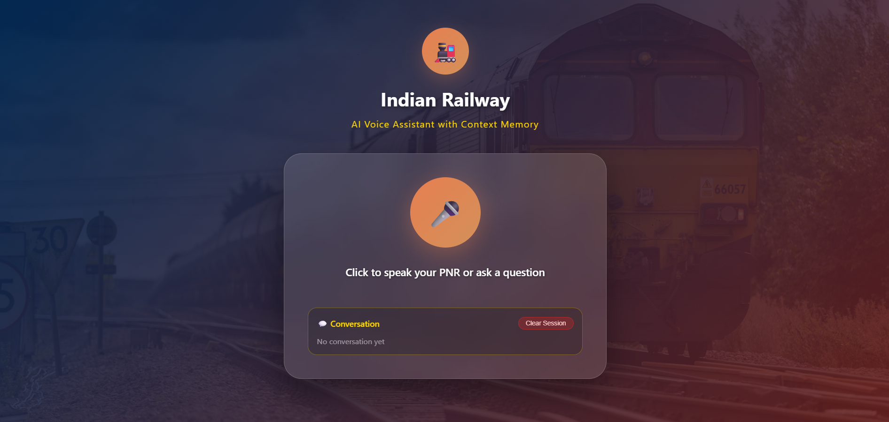

# 🚂 Indian Railway PNR Voice Assistant

An AI-powered multilingual voice assistant for checking Indian Railway PNR (Passenger Name Record) status. Speak your PNR number in any of 11+ Indian languages, get instant status updates with voice responses, and ask follow-up questions with full conversational context memory.



## 🎥 Demo

Check out our [demo video]([demo.mp4](https://github.com/Shubham8831/S2S-PNR-Status-Agent/raw/main/demo_video.mp4)) to see the assistant in action!

## ✨ Features

### Voice Interaction
- **Speech-to-Text**: Records your voice and transcribes it using OpenAI Whisper
- **Text-to-Speech**: Responds back in natural voice using Google Text-to-Speech (gTTS)
- **One-Click Operation**: Simple microphone button for seamless interaction

### Multilingual Support
Supports **11+ Indian languages**:
- Hindi (हिंदी)
- English
- Tamil (தமிழ்)
- Telugu (తెలుగు)
- Bengali (বাংলা)
- Marathi (मराठी)
- Gujarati (ગુજરાતી)
- Kannada (ಕನ್ನಡ)
- Malayalam (മലയാളം)
- Punjabi (ਪੰਜਾਬੀ)
- Urdu (اردو)

### Smart Context Memory
- **Session Management**: Maintains conversation history per user
- **Follow-up Questions**: Ask "what's my train number?" without repeating PNR
- **Contextual Responses**: Uses LLM (Llama 3.3 70B) for intelligent answers
- **Conversation History Display**: See past interactions in real-time

### Robust PNR Checking
- **Dual Method Approach**: 
  1. Primary: RapidAPI for instant results
  2. Fallback: Selenium web automation if API fails
- **Intelligent PNR Extraction**: Handles spoken digits in multiple languages
- **Error Handling**: Graceful fallbacks and clear error messages

### MCP Server Integration
- **Model Context Protocol**: Expose PNR checking as tools for AI agents
- **RESTful & MCP**: Both API types supported
- **Tool-based Architecture**: Easy integration with Claude, ChatGPT, or custom agents

## 🏗️ Architecture

```
┌─────────────────────────────────────────────────────────────┐
│                        Frontend (HTML/JS)                    │
│  • Voice Recording (MediaRecorder API)                      │
│  • Audio Playback                                           │
│  • Session Management UI                                    │
└──────────────────────┬──────────────────────────────────────┘
                       │ HTTP/REST
┌──────────────────────▼──────────────────────────────────────┐
│                    FastAPI Backend (api.py)                  │
│  • /unified_voice_input - Main voice endpoint               │
│  • /text_to_speech - TTS conversion                         │
│  • /clear_session - Session management                      │
│  • /session_status - Get session info                       │
└──────────────────────┬──────────────────────────────────────┘
                       │
        ┌──────────────┴──────────────┐
        │                             │
┌───────▼────────┐          ┌─────────▼─────────┐
│ Whisper Model  │          │  status_extractor │
│ (Speech→Text)  │          │  • RapidAPI       │
└────────────────┘          │  • Selenium       │
                            └─────────┬─────────┘
┌────────────────┐                    │
│ gTTS           │          ┌─────────▼─────────┐
│ (Text→Speech)  │          │ Groq LLM          │
└────────────────┘          │ (Llama 3.3 70B)   │
                            │ • Summarization   │
                            │ • Q&A Generation  │
                            └───────────────────┘
```

## 🛠️ Technology Stack

### Backend
- **FastAPI**: High-performance async web framework
- **OpenAI Whisper**: State-of-the-art speech recognition (medium model)
- **gTTS**: Google Text-to-Speech for voice responses
- **Selenium**: Web automation for fallback PNR checking
- **LangChain + Groq**: LLM integration for intelligent responses
- **langdetect**: Automatic language detection

### Frontend
- **Vanilla JavaScript**: No framework dependencies
- **MediaRecorder API**: Native browser voice recording
- **HTML5 Audio**: Playback of AI responses
- **CSS3**: Modern glassmorphism design

### AI/ML
- **Whisper (medium)**: 769M parameter ASR model
- **Llama 3.3 70B**: Via Groq API for fast inference
- **Language Detection**: Automatic multilingual support

### Infrastructure
- **MCP Server**: Tool-based architecture for AI agents
- **Session Management**: In-memory state management
- **Dual PNR APIs**: RapidAPI + web scraping fallback

## 📋 Prerequisites

- Python 3.8 or higher
- Chrome/Chromium browser (for Selenium automation)
- Microphone access (for voice input)
- Internet connection

## 🚀 Installation

### 1. Clone the Repository

```bash
git clone https://github.com/shubham8831/pnr-voice-assistant.git
cd pnr-voice-assistant
```

### 2. Install Dependencies

```bash
pip install -r requirements.txt
```

### 3. Set Up Environment Variables

Create a `.env` file in the root directory:

```env
# Required: Groq API Key for LLM
GROQ_API_KEY=your_groq_api_key_here

# Required: RapidAPI Key for PNR status
RAPID_API_KEY=your_rapidapi_key_here
```

#### Getting API Keys:

**Groq API Key:**
1. Visit [https://console.groq.com](https://console.groq.com)
2. Sign up/Login
3. Navigate to API Keys section
4. Create new API key
5. Copy and paste into `.env`

**RapidAPI Key:**
1. Visit [https://rapidapi.com](https://rapidapi.com)
2. Sign up/Login
3. Subscribe to [IRCTC PNR Status API](https://rapidapi.com/irctcapi/api/irctc-indian-railway-pnr-status)
4. Copy your API key from dashboard
5. Paste into `.env`

### 4. Download Whisper Model

The first run will automatically download the Whisper medium model (~1.5GB):

```bash
python -c "import whisper; whisper.load_model('medium')"
```

## 🎮 Usage

### Running the Application

1. **Start the Backend Server:**

```bash
python api.py
```

The server will start on `http://localhost:8000`

2. **Open the Frontend:**

Simply open `index.html` in your web browser:

```bash
# On macOS
open index.html

# On Linux
xdg-open index.html

# On Windows
start index.html
```

Or use Python's built-in server:

```bash
python -m http.server 8080
```

Then visit `http://localhost:8080/index.html`

### How to Use

1. **Click the microphone button** 🎤
2. **Speak your PNR number** (e.g., "My PNR is 2608290686")
3. **Wait for processing** (transcription → PNR check → summary generation)
4. **Listen to the response** in your language
5. **Ask follow-up questions** like:
   - "What is my train number?"
   - "What time does my train depart?"
   - "Am I confirmed?"
   - "Which coach am I in?"

### Multilingual PNR Input

You can speak PNR digits in any supported language:

**Hindi Example:**
- "Mera PNR number hai do chaar saat ek teen..."
- "पी॰एन॰आर॰ है दो छह शून्य आठ..."

**Tamil Example:**
- "En PNR number irandu aaru poojiyam..."

The system automatically detects the language and responds accordingly!

## Running MCP Server

For AI agent integration (Claude, custom tools, etc.):

```bash
python MCP_Server.py
```

The MCP server exposes the following tools:
- `check_pnr_status`: Check PNR with multiple methods
- `generate_summary`: Generate natural language summaries
- `extract_pnr`: Extract PNR from text
- `detect_text_language`: Detect input language
- `create_session`: Create conversation session
- `update_session`: Update session data
- `clear_session`: Clear session
- `get_session_history`: Get conversation history
- `check_and_summarize`: Combined PNR check + summary

## 📁 Project Structure

```
pnr-voice-assistant/
│
├── api.py                  # Main FastAPI backend server
├── status_extractor.py     # PNR checking logic (API + Selenium)
├── MCP_Server.py          # MCP server for AI agent integration
├── index.html             # Frontend UI
├── requirements.txt       # Python dependencies
├── .env                   # Environment variables (create this)
│
├── main.py               # Entry point (optional)
├── README.md             # This file
│
├── demo.mp4              # Demo video
└── screenshot.png        # UI screenshot
```

## 🔧 Configuration

### Changing Whisper Model

In `api.py`, line 22:

```python
whisper_model = whisper.load_model("medium")  # Options: tiny, base, small, medium, large
```

**Model Trade-offs:**
- `tiny`: Fastest, least accurate (~75MB)
- `base`: Fast, good accuracy (~142MB)
- `small`: Balanced (~466MB)
- `medium`: High accuracy, slower (~1.5GB) ⭐ **Recommended**
- `large`: Best accuracy, slowest (~3GB)

### Changing LLM Model

In `api.py`, line 35:

```python
model = ChatGroq(model="llama-3.3-70b-versatile", api_key=key)
```

Available Groq models:
- `llama-3.3-70b-versatile`: Best reasoning (recommended)
- `llama-3.1-8b-instant`: Fastest responses
- `mixtral-8x7b-32768`: Large context window

## 🎨 Features in Detail

### Session Management

Each user gets a unique session that persists:
- Current PNR
- Last fetched status
- Conversation history
- Language preference

Sessions are maintained in-memory and can be cleared via the UI.

### PNR Extraction Intelligence

The system handles various input formats:

```python
# All these work:
"My PNR is 2608290686"
"PNR number two six zero eight two nine zero six eight six"
"mere PNR do chhe shunya aath..." (Hindi)
"என் பி.என்.ஆர் இரண்டு ஆறு..." (Tamil)
```

### Fallback Strategy

1. **Primary**: RapidAPI call (~0.5s response)
2. **Fallback**: Selenium automation (~10s response)
   - Launches headless Chrome
   - Navigates to ConfirmTKT
   - Fills form and extracts data
   - Parses HTML intelligently

### Error Handling

- Microphone permission denied
- Invalid PNR format
- API rate limits
- Network failures
- Empty audio
- Processing timeouts

All errors show user-friendly messages with actionable solutions.

## 🐛 Troubleshooting

### "Microphone access denied"
- Check browser permissions (chrome://settings/content/microphone)
- Try using HTTPS or localhost

### "Unable to fetch PNR status"
- Verify PNR is valid (10 digits)
- Check RAPID_API_KEY in .env
- Try again after a minute (rate limiting)

### "Processing takes too long"
- First run downloads Whisper model (~1.5GB)
- Selenium fallback takes 8-12 seconds
- Check internet connection

### "Audio not playing"
- Check browser audio permissions
- Verify speakers/headphones connected
- Try different browser

### Chrome Driver Issues
```bash
# Manually update ChromeDriver
pip install --upgrade webdriver-manager
```

##  Security & Privacy

- **No data storage**: Sessions are in-memory only
- **No PNR logging**: PNR numbers are not saved to disk
- **Secure APIs**: All API calls over HTTPS
- **Local processing**: Whisper runs locally (no cloud transcription except Groq LLM)


## 📊 Performance

- **Whisper transcription**: 2-4 seconds
- **RapidAPI PNR check**: 0.5-1 second
- **Selenium fallback**: 8-12 seconds
- **LLM summary generation**: 1-2 seconds
- **TTS generation**: 0.5-1 second

**Total response time**: 4-8 seconds (API mode) or 12-20 seconds (Selenium fallback)


## 🙏 Acknowledgments

- **OpenAI Whisper**: Speech recognition
- **Groq**: Fast LLM inference
- **RapidAPI**: PNR status API
- **Indian Railways**: PNR system
- **ConfirmTKT**: Fallback data source

## 📧 Contact

For questions or support:
- Create an issue on GitHub
- LinkedIn: [shubham](https://www.linkedin.com/in/shubham8831/)

**Made with ❤️ for Indian Railway passengers**

🚂 Happy Journey! 🚂
